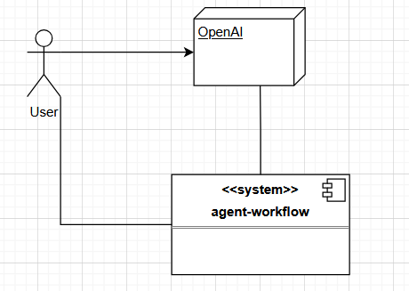
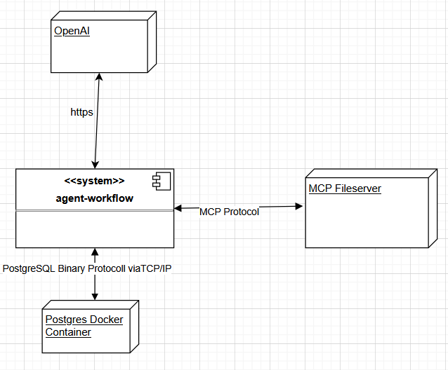

# 3. Context and Scope
This section describes the boundaries of the system from its communication partners, including adjacent systems and users. 

The system is presented as a black box.

The external interfaces are specified. If necessary, a distinction is made between the business context (domain-specific inputs and outputs) and the technical context (channels, protocols, hardware).

A clear understanding of these interfaces is essential, as they are among the most critical aspects of the system.

## 3.1 Business context

The user must have an OpenAI account as well as an api key.
The user must then provide the API key to the system
in order to use it.

## 3.2 Technical context

The system uses a MCP Fileserver. The Model Context Protocol was created by Antrophic.
It describes a way to provide context, i.e. prompt templates, resources, tools, to a LLM.
The MCP Fileserver is used to access files on the local machine.

OpenAI is currently the only LLM vendor used by the system.

All agent output is stored in a postgres database. The postgres runs in a docker container on
the local machine.