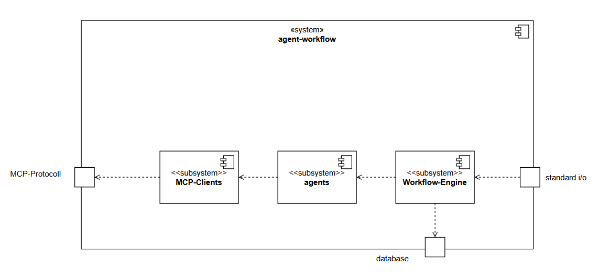

# 5. Building Block view
The building block view shows which building blocks the system is made of. A non exhaustive list of building block examples are: modules, components, subsystems, classes, interfaces, packages, libraries, frameworks, layers, partitions, tiers, functions, macros, operations, data structures (see https://docs.arc42.org/section-5/).

The system is presented as a white box.

## 5.1 Level 1

The system agent workflow has three components at level 1.

Workflow-Engine
- The "Workflow-Engine" provides shell commands that can be
used to execute a workflow. The port "standard I/O"
is used to pass the shell commands to the engine.
The Workflow Engine will read the workflow specification
file using an appropriate agent. Furthermore,
the Workflow Engine will create the agents specified
inside the workflow specification.
The Workflow Engine will also save the execution
state inside a database, as well as the agent outputs.

agents
- Agents provide specific capabilities such as file writing
and llm calls. 

MCP-Clients
- The agents may create an MCP client if necessary.
The "MCP-Clients" will make calls to the MCP-Fileserver
in order read or write files. The communicate
over the MCP-Protocoll.

LLM-Gateway
- The LLM-Gateway enables the system to make llm calls to
various llm providers.
- If a fallback occurs the llm gateway will route the call
to a different llm.

