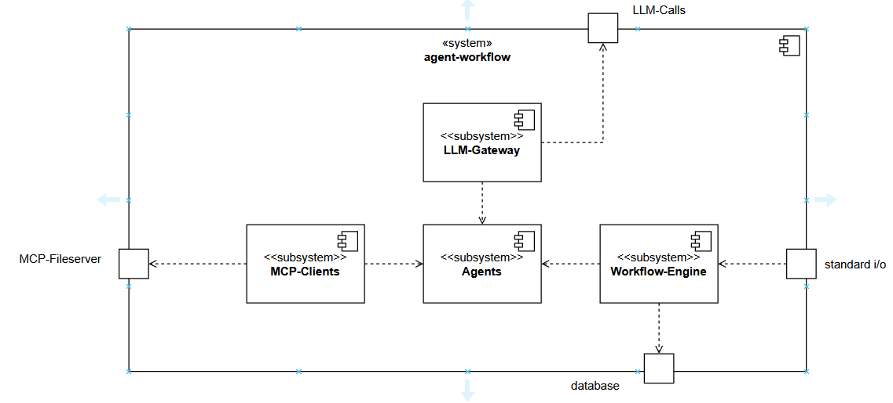

# 5. Building Block view
The building block view shows which building blocks the system is made of. A non exhaustive list of building block examples are: modules, components, subsystems, classes, interfaces, packages, libraries, frameworks, layers, partitions, tiers, functions, macros, operations, data structures (see https://docs.arc42.org/section-5/).

The system is presented as a white box.

## 5.1 Level 1

The system agent workflow has four components at level 1.

Workflow-Engine
- The Workflow-Engine is responsible for reading the workflow specification file, instantiation of the agents
defined inside the specification file, and persistence of the execution state.

Agents
- The Agents building block provides specific agents with specific capabilities.
- It also defines Interfaces for the usage of MCP and the LLM-Calls (inversion of controll).

MCP-Clients
- The building block MCP-Clients is responsible for providing the funcionality defined by the 
interfaces inside the agents building block by using MCP-Clients to access MCP-Server (inversion of controll).

LLM-Gateway
- The building block LLM-Gateway is responsible for providing access to LLMs via the implementation
of interfaces defined inside the agents  building block (inversion of controll).